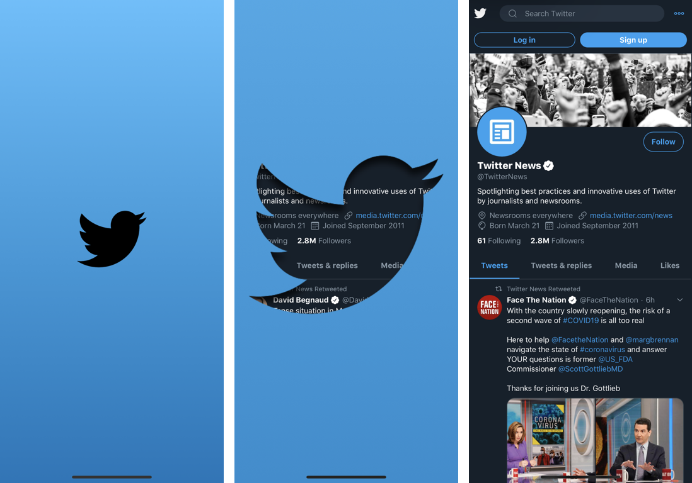

# TwitterNews

[Platform](http://img.shields.io/badge/platform-iOS-lightgrey.svg?style=flat)](https://developer.apple.com/resources/)
[Issues](https://img.shields.io/github/issues/bizz84/SwiftyStoreKit.svg?style=flat)](https://github.com/PepperoniJoe/TwitterNews/Issues)

An iOS app for reading Twitter news. Demo of expanding Twitter logo.

\
**Features**
- Dark/Light mode
- Access to Twitter News feed via Twitter

**Inspired By Other Twitter Splash app projects:** \
https://github.com/soapyigu/Swift-30-Projects/tree/master/Project%2013%20-%20TwitterBird \
https://github.com/PiXeL16/RevealingSplashView \
https://github.com/jkosoy/TwitterSplashDemo \
https://github.com/rounak/TwitterBirdAnimation/

**Technical Info:** \
Xcode 11  project written in Swift 5 for iOS

**Author:** \
Marcy Vernon [@MarcyVernon](https://twitter.com/MarcyVernon)

**License:** \
"TwitterNews" is under the MIT license. See [LICENSE](/LICENSE) for more information.
